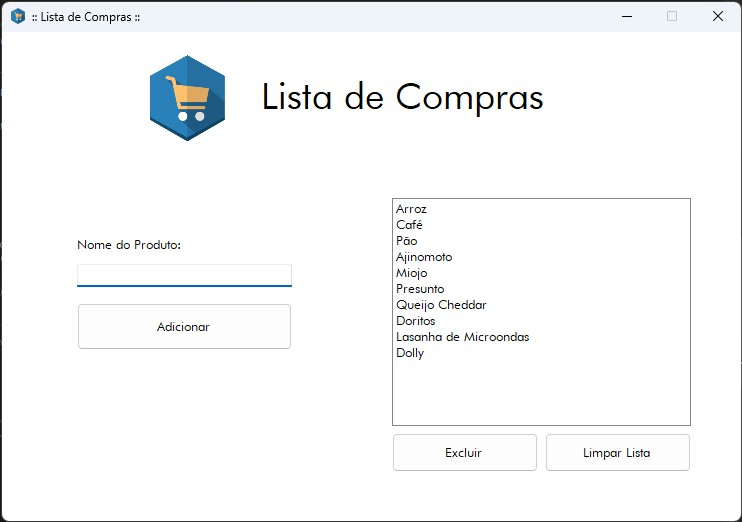

# Gerenciador de Lista de Compras - C# Windows Forms

Este é um programa simples desenvolvido em C# utilizando Windows Forms para gerenciamento de uma lista de compras. O aplicativo permite ao usuário adicionar, visualizar e remover itens de uma lista de maneira prática e intuitiva.

---

## Funcionalidades

- **Adicionar itens:** Insira o nome do item em um `TextBox` e adicione-o à lista de compras exibida no `ListBox`.
- **Excluir item individual:** Selecione um item da lista e remova-o com o clique de um botão.
- **Limpar lista inteira:** Apague todos os itens da lista de uma vez só.
- **Recursos de usabilidade:**  
  - Validação para evitar inclusão de itens vazios ou duplicados.  
  - Mensagens de confirmação para exclusão total da lista.  
  - Interface simples e amigável.

---

## Como usar

1. Digite o nome do item que deseja adicionar no campo de texto.
2. Clique em **Adicionar** para inserir o item na lista.
3. Para excluir um item, selecione-o na lista e clique em **Excluir Item**.
4. Para apagar toda a lista, clique em **Limpar Lista** e confirme a ação.

---

## Imagem do Programa

---

## Tecnologias utilizadas

- C#  
- Windows Forms (.NET Framework)

---

## Contribuições

Contribuições são bem-vindas! Sinta-se à vontade para abrir issues ou pull requests para melhorias.

---

## Licença

Este projeto está sob a licença MIT. Veja o arquivo LICENSE para mais detalhes.
